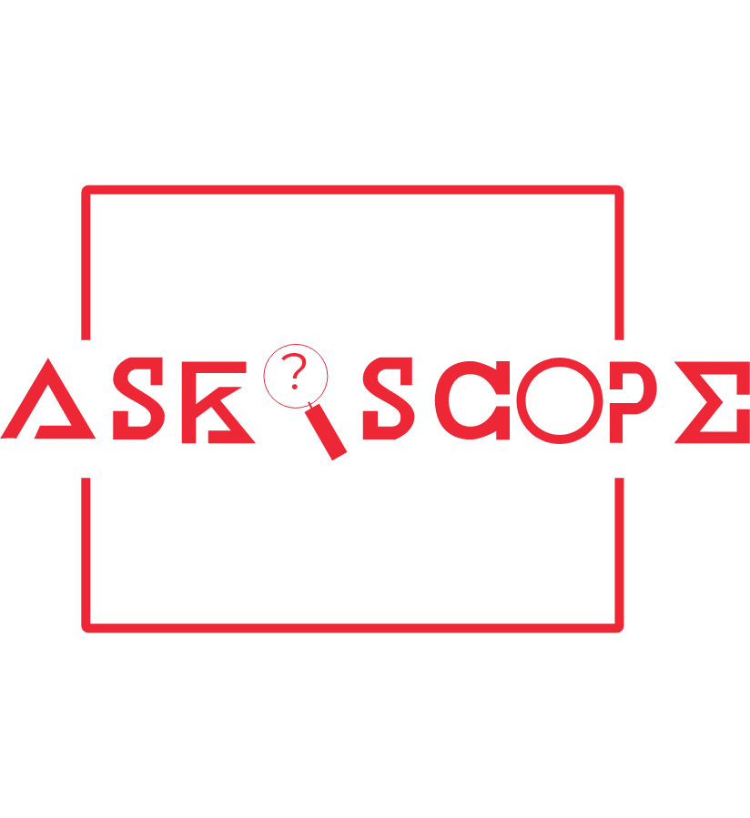
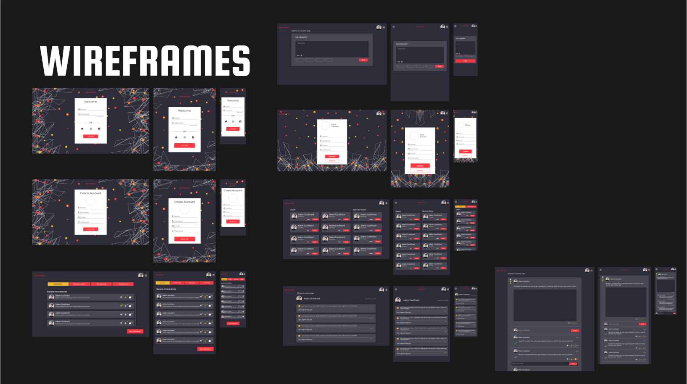
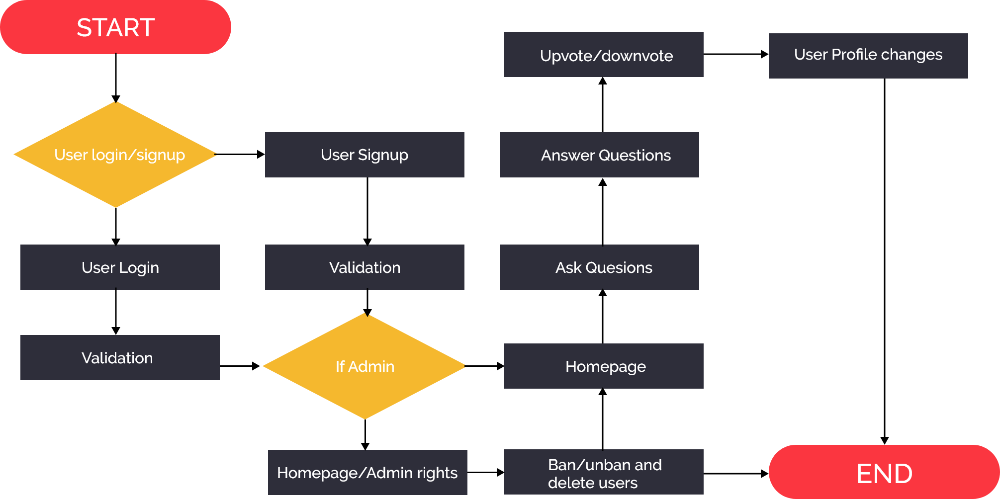

<!-- PROJECT LOGO -->
<br />


<h6 align="center">Pieter Venter DV204</h6>
<p align="center">
</br>

  <a href="https://github.com/Pieter-stack/AskScope">
    
  </a>

  <h3 align="center">AskScope</h3>

  <p align="center">
    Question And Answer website for gamers<br>
      <a href="https://github.com/Pieter-stack/AskScope"><strong>Explore the docs »</strong></a>
   <br />
   <br />
   <a href="">View Demo</a>
    ·
    <a href="https://github.com/Pieter-stack/AskScope/issues">Report Bug</a>
    ·
    <a href="https://github.com/Pieter-stack/AskScope/issues">Request Feature</a>
  </p>

<!-- TABLE OF CONTENTS -->
## Table of Contents

* [About the Project](#about-the-project)
* * [Project Description](#project-description)
  * [Built with](#built-with)
* [Getting Started](#getting-started)
  * [Prerequisites](#prerequisites)
  * [How to install](#how-to-install)
* [Features and Functionality](#features-and-functionality)
   * [Features](#features)
   * [Functionality](#functionality)
* [Concept Process](#concept-process)
   * [Wireframes](#wireframes)
   * [User-flow](#user-flow)
* [Development Process](#development-process)
   * [Implementation](#implementation)
* [Mockups](#mockups)
* [Roadmap](#roadmap)
* [Contributing](#contributing)
* [License](#license)
* [Contact](#contact)
* [Acknowledgements](#acknowledgements)

<!--PROJECT DESCRIPTION-->
## About the Project

<!--![image1][image1]-->
   

### Project Description

I have created an Question and Answer website for gamers, due to my interest in gaming I thought it would be great idea to start.

The use of this website is to bring gamers together and on a platform where they can ask questions about games they like and get answers and comments on the questions they asked, the website feautures a register page and login page for the user to sign up and sign in with ease. The user can also edit his/her destails and logout if needed. The homepage features a filter option to search between some gaming categories and showcasing the recent asked question, there is also a ask question button to quickly direct the user to the question page. On the home page the user can upvote and downvote questions and on the question details page the user can upvote and downvote comments and also give an comment a check.The admin can ban, unban and delete users, tyhey can also delete questions and comments.

The website is fully responsive and is built for web, ipad and mobile.

### Built With

* [Composer](https://kotlinlang.org/)
* [GitHub](https://github.com/)
* [PHP](https://kotlinlang.org/)
* [PostgreSQL](https://kotlinlang.org/)
* [Symfony](https://tornadofx.io/)

&nbsp;&nbsp;&nbsp;&nbsp;&nbsp;&nbsp;&nbsp;&nbsp;
&nbsp;&nbsp;&nbsp;&nbsp;&nbsp;&nbsp;&nbsp;&nbsp;
&nbsp;&nbsp;&nbsp;&nbsp;&nbsp;&nbsp;&nbsp;&nbsp;
&nbsp;&nbsp;&nbsp;&nbsp;&nbsp;&nbsp;&nbsp;&nbsp;
&nbsp;&nbsp;&nbsp;&nbsp;&nbsp;&nbsp;&nbsp;&nbsp;


<!-- GETTING STARTED -->
## Getting Started

These instructions will get you a copy of the project up and running on your local machine for development and testing purposes.

### Prerequisites

Ensure that you have the latest version of PHP installed on your machine.

### How to install

### Installation
Here are a couple of ways to clone this repo:

1. Clone the repo
```sh
git clone https:://github.com/Pieter-stack/AskScope.git
```
2. Install XAMPP/MAMP or WAMP

XAMPP-https://www.apachefriends.org/index.html    <br>
MAMP-https://www.mamp.info/en/windows/  <br>
WAMP-https://sourceforge.net/projects/wampserver/ 

2.1 If on Mac you can also do...

```sh
$php-v

$brew update
$brew install php

$export PATH="$(brew--prefix homebrew/core/php)/bin:$PATH"
```

3. Install Composer

Composer-https://getcomposer.org/download/

4. Install Symfony

Symfony-https://symfony.com/download

```sh
$Symfony check:requirments
```

5. Other packages I used

```sh
$composer require debug

$composer require annotations
```
```sh
$composer require twig
```
```sh
$composer require symfony/orm-pack

$composer require --dev symfony/maker-bundle
```
```sh
$composer require symfony/form

$composer require symfony/validator
```
6. To setup db on your own machine

 ```sh
$php bin/console doctrine:database:create

$php bin/console make:migration

$php bin/console doctrine:migrations:migrate
```

7. Start project
 ```sh
$symfony server:start
```


<!-- FEATURES AND FUNCTIONALITY-->
## Features and Functionality

### Features
   


<!--![image2][image2]-->
   

### Functionality
The user can create their own account and signinto the website and also logout.The user can also post questions and reply to questions as comments. Questions and COmments can be downvoted and upvoted and comments can be marked as helpful, Admin can ban and unban users and also delete users, comments and questions

<!-- CONCEPT PROCESS -->
## Concept Process

The `Conceptual Process` is the set of actions, activities and research that was done when starting this project.


### Wireframes
   
<!--![image7][image7]-->

### User-flow

<!--![image8][image8]-->
 

<!-- DEVELOPMENT PROCESS -->
## Development Process

The `Development Process` is the technical implementations and functionality done in the backend of the application.

### Implementation


1. Firstly I made the Login and Register page, where the user can signup and be posted to the db and the login to the website I also added a logout feature.
2. I then did the CRUD functionality of editing user data and posting questions and comments. I later did the CRUD for the Admin where you can delete , ban and unban users.
3. For the AJAX requests, I used them to upvote and downvote comments and questions as well as mark comments as an answer.
4. I then Finished the project off with some styling and uploaded it to heroku.


#### Challenges

Had issues with deploying to heroku but got it sorted at the end.


<!-- MOCKUPS -->
## Mockups

<!--![image9][image9]-->
   
<br>
<!--![image10][image10]-->
   


<!-- ROADMAP -->
## Roadmap

See the [open issues](https://github.com/dylandasilva1999/enum-integrateX/issues) for a list of proposed features (and known issues).

<!-- CONTRIBUTING -->
## Contributing

Contributions are what makes the open-source community such an amazing place to learn, inspire, and create. Any contributions you make are **greatly appreciated**.

1. Fork the Project
2. Create your Feature Branch (`git checkout -b feature/AmazingFeature`)
3. Commit your Changes (`git commit -m 'Add some AmazingFeature'`)
4. Push to the Branch (`git push origin feature/AmazingFeature`)
5. Open a Pull Request

<!-- AUTHORS -->
## Authors

* **Pieter Venter** - [Pieter Venter](https://github.com/Pieter-stack)

<!-- LICENSE -->
## License

Distributed under the MIT License. See `LICENSE` for more information.

<!-- LICENSE -->
## Contact

* **Pieter Venter** - 200054@virtualwindow.co.za
* **Project Link** - https://github.com/Pieter-stack/AskScope

<!-- ACKNOWLEDGEMENTS -->
## Acknowledgements

* [My lecturer Armand Pretorious]
* https://github.com/VincentGarreau/particles.js/


